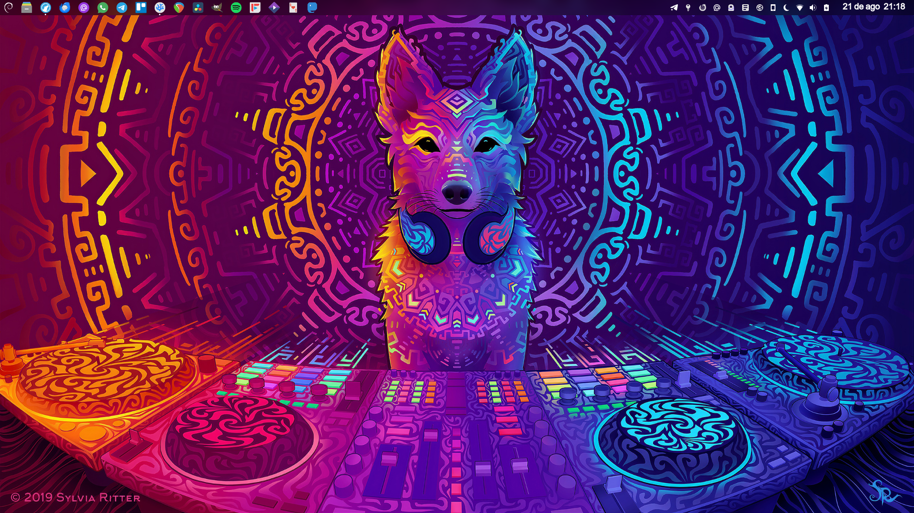
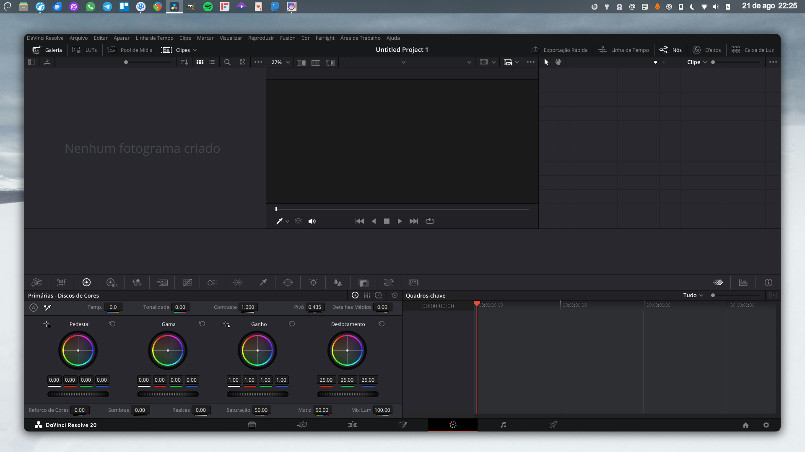
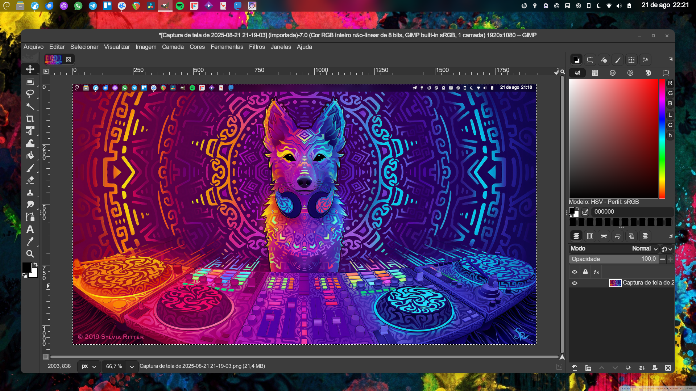
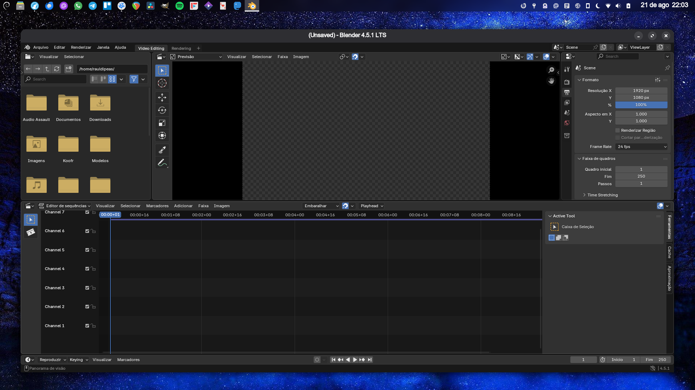
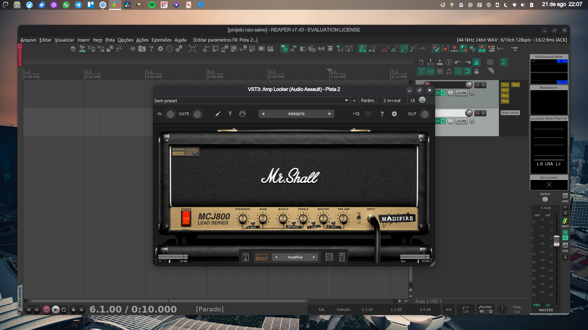
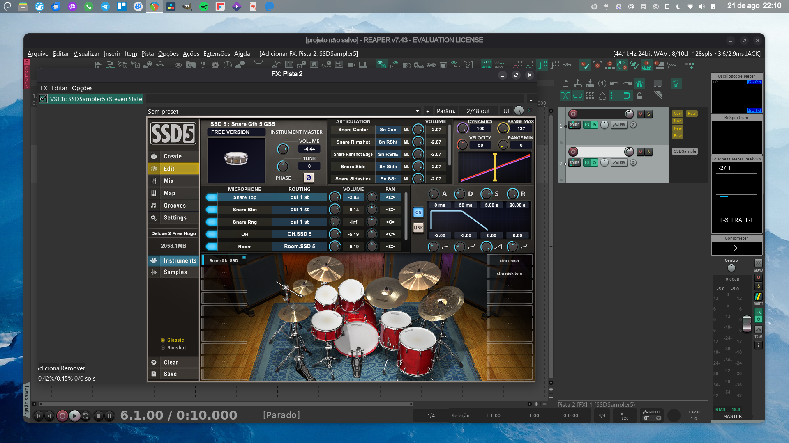

---
authors:
  - name: "Raul Dipeas"
    email: github@rauldipeas.com.br
    link: https://rauldipeas.com.br
    avatar: https://rauldipeas.com.br/assets/images/avatar.jpg
category:
  - lançamento
templating: false
---
# O que há de novo no Estúdio Debian?

Na data de hoje `(21/08/2025)`, o **Estúdio Debian** está num estágio bem inicial, porém, totalmente funcional.

O repositório já conta com diversos programas, plugins de áudio e configurações que foram exaustivamente testadas ao longo dos últimos anos.

Tudo que há de melhor pra produção de conteúdo multimídia está reunido aqui.

Programas como **REAPER**, **DaVinci Resolve**, **GIMP** e **Blender** são instalados em suas últimas versões, com uma adição de complementos e configurações pra que você possa extrair o máximo possível deles, tudo selecionado a dedo pra que eles sejam executados com a melhor desempenho possível, além de complementos visuais e funcionais também.

Ainda não houve tempo hábil pra detalhar todas as páginas, por enquanto elas só contém os scripts e o botão de execução, mas, muito em breve descrições detalhadas serão adicionadas.

Todos os scripts foram testados no **Debian 13** e no **Ubuntu 24.04**.

O script do *Glaxnimate* não funciona no Debian, há um aviso na página.

Esse programa é um pouco complicado de compilar e no momento ele não é compatível com o *FFMPEG* disponível no repositório do Debian.

É possível aplicar um patch pra atualizar o código, mas, não é exatamente uma solução, tá mais pra uma gambiarra, é melhor esperar os desenvolvedores atualizarem o código.

Há uma seleção bem apurada de plugins de áudio nativos, tanto no formato **VST** quanto nos formato **Clap** e **LV2**, todos escolhidos pelo seu alto padrão de qualidade sonora, estamos vivendo tempos realmente incríveis nessa área, muitas empresas estão lançando plugins nativos pra Linux.

O **WINE** instalado pelo script está na versão `9.0`, que não é exatamente uma versão *recente*, mas, também não é *tão antiga*.

O motivo pra isso, é que a última versão compatível com o `yabridge` é a `9.21`, porém, essa versão gera um conflito com alguns instaladores de plugins, como é o caso do SSD 5 Free, ele instala as bibliotecas, mas, não instala o plugin.

O instalador até mostra que deu tudo certo, porém o arquivo do plugin não é instalado.

Com a versão disponível no script, tudo funciona sem problemas.

Espero que este repositório seja útil pra você que produz música, vídeo e imagem no Linux! 

*(slbr+avix feelings in memorian)*